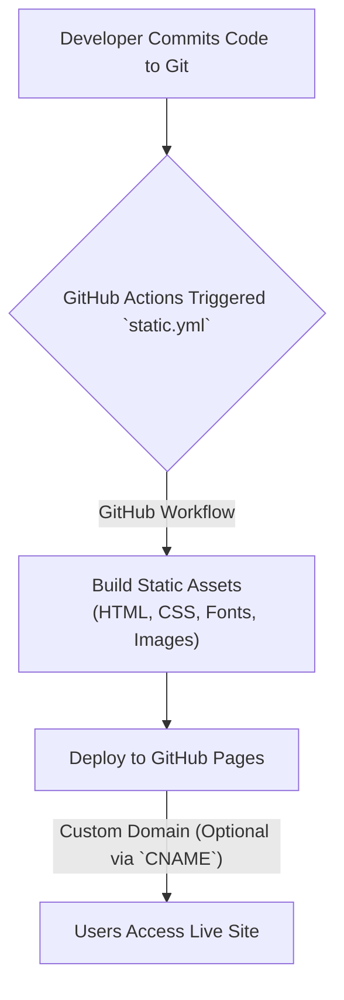

# 🚀 Discord Clone

<p align="center"></p>

Dive into a pixel-perfect replication of Discord's sleek and engaging landing page. This project is a testament to modern frontend development, showcasing an impressive blend of responsive design, vibrant aesthetics, and a robust styling workflow. Experience the precision of a beloved platform's interface, built from the ground up for the web.

## Short Description
A meticulously crafted, responsive frontend replica of Discord's iconic landing page, showcasing modern web development practices and a commitment to pixel-perfect design. This project focuses solely on the user interface, bringing the visual fidelity of Discord to life in a browser environment.

## ✨ Key Features

*   **Authentic Design Replication:** A faithful, high-fidelity recreation of Discord's distinctive user interface and landing page layout.
*   **Responsive Layout:** Engineered to provide a seamless and visually consistent experience across desktops, tablets, and mobile devices.
*   **Custom Typography Integration:** Leverages custom font families like Ginto-Nord, Ginto, Whitney, and gg-sans to precisely match Discord's unique brand identity.
*   **Optimized Vector Graphics:** Utilizes Scalable Vector Graphics (SVG) for all imagery, ensuring crisp, resolution-independent visuals that load efficiently.
*   **Modern CSS Workflow:** Built with **Tailwind CSS** for utility-first styling and managed by **PostCSS** for advanced transformations, including autoprefixing and nested CSS.
*   **Static Site Generation Ready:** Optimized for performance and deployability as a static website, ideal for high-speed content delivery.
*   **Automated Deployment:** Configured with GitHub Actions (`static.yml`) for continuous integration and automated deployment to static hosting platforms like GitHub Pages, complete with custom domain support (`CNAME`).

## Who is this for?

*   **Frontend Developers:** Ideal for those looking to study, learn from, or contribute to a well-structured, modern frontend project with advanced CSS and build tooling.
*   **UI/UX Designers:** A fantastic reference for understanding design implementation, responsive patterns, and the conversion of high-fidelity mockups into functional web experiences.
*   **Web Development Learners:** Provides a practical example of integrating powerful CSS frameworks, managing static assets, and setting up automated deployment pipelines.
*   **Technical Marketers:** Demonstrates how detailed UI replication can serve as a compelling portfolio piece or a foundation for marketing-focused landing pages.

## Technology Stack & Architecture

This project is a pure frontend application, leveraging a modern development stack for optimal performance, maintainability, and developer experience.

*   **Frontend Technologies:** HTML5, CSS3, Vanilla JavaScript
*   **Styling Framework:** [Tailwind CSS](https://tailwindcss.com/)
*   **CSS Pre/Post-processing:** [PostCSS](https://postcss.org/) with [Autoprefixer](https://github.com/postcss/autoprefixer) and [postcss-import](https://github.com/postcss/postcss-import), [postcss-nested](https://github.com/postcss/postcss-nested)
*   **Build Tooling:** [Vite](https://vitejs.dev/) (indicated by `node_modules` presence, a fast frontend build tool)
*   **Dependency Management:** npm / Yarn
*   **Continuous Integration/Deployment:** GitHub Actions

## 📊 Architecture & Database Schema

As a purely frontend repository focused on UI replication, this project does not include a backend or database schema. Its architecture primarily revolves around the efficient deployment and serving of static assets.



## ⚡ Quick Start Guide

To get this Discord Clone running locally or to inspect its codebase, follow these simple steps:

1.  **Clone the repository:**
    ```bash
    git clone https://github.com/grewal16/Discord_clone.git
    cd Discord_clone
    ```

2.  **Install dependencies:**
    ```bash
    npm install
    # or yarn install
    ```

3.  **Start the development server (Optional, for dynamic rebuilding):**
    If a `vite` development server is configured (common for projects with `node_modules/vite`):
    ```bash
    npm run dev
    # or yarn dev
    ```
    Alternatively, for a static preview, simply open `index.html` in your browser.

4.  **Build for production (Optional):**
    ```bash
    npm run build
    # or yarn build
    ```
    This will generate optimized static assets in a `dist/` folder (or similar, depending on Vite configuration).