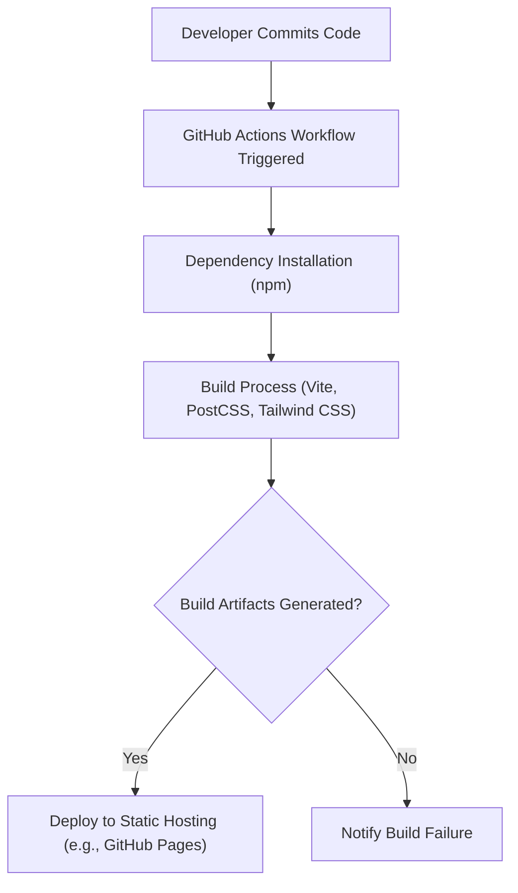

# 🚀 Discord Clone: A High-Fidelity UI Replica

<p align="center"></p>

## Short Description
Dive into a meticulously crafted, pixel-perfect replica of the Discord user interface. This project is a stunning testament to modern web development, showcasing a responsive and visually engaging frontend built with cutting-edge CSS frameworks and efficient build tooling. Experience the familiar Discord aesthetic, reimagined for the web, focusing on intricate details and smooth performance.

## ✨ Key Features
*   **High-Fidelity UI/UX:** A faithful reproduction of Discord's iconic design, ensuring a familiar and immersive user experience.
*   **Responsive Design:** Flawlessly adapts across various screen sizes and devices, from desktops to mobile.
*   **Custom Typography:** Integrates Discord's custom fonts (`Ginto-Nord`, `Ginto`, `Whitney`, `gg-sans`) for authentic visual branding.
*   **Modern Styling Workflow:** Leverages Tailwind CSS with PostCSS for rapid, utility-first styling and efficient CSS management.
*   **Optimized Asset Delivery:** Utilizes Vite for a blazing-fast development experience and optimized production builds.
*   **Automated Deployment:** Features GitHub Actions for Continuous Integration and Continuous Deployment (CI/CD) to static hosting platforms, ensuring seamless updates.
*   **Custom Domain Support:** Configured for custom domain usage via `CNAME`, ready for production deployment.

## Who is this for?
*   **Frontend Developers:** A fantastic reference for building complex, highly-stylized web interfaces and mastering modern CSS techniques.
*   **UI/UX Enthusiasts:** Ideal for dissecting and understanding the intricacies of popular application designs.
*   **Learners:** A practical example demonstrating the integration of Tailwind CSS, PostCSS, and Vite in a real-world project.
*   **Designers:** Explore the implementation of a consistent and attractive visual language on the web.

## Technology Stack & Architecture
This project is engineered for speed, maintainability, and a top-tier developer experience:

*   **Frontend:** HTML5, CSS3
*   **Styling:** Tailwind CSS (utility-first framework), PostCSS (CSS transformation)
*   **Build Tool:** Vite (modern frontend tooling for fast development and optimized builds)
*   **Package Management:** npm
*   **Continuous Integration/Deployment:** GitHub Actions

## 📊 Architecture & Database Schema
This project is a static UI clone, thus it does not include a backend or database. The core architecture revolves around a robust frontend build and deployment pipeline:



## ⚡ Quick Start Guide
To get this Discord UI clone up and running on your local machine:

1.  **Clone the Repository:**
    ```bash
    git clone https://github.com/grewal16/Discord_clone.git
    cd Discord_clone
    ```

2.  **Install Dependencies:**
    ```bash
    npm install
    ```

3.  **Start the Development Server:**
    ```bash
    npm run dev
    ```
    This will launch the development server, typically at `http://localhost:5173`.

4.  **Build for Production:**
    ```bash
    npm run build
    ```
    This command will generate optimized static assets in the `dist/` directory, ready for deployment.