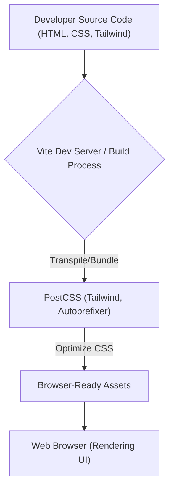

# 🚀 Discord_clone

<p align="center"></p>

<p align="center">
  <a href="https://github.com/grewal16/Discord_clone/stargazers"></a>
  <a href="https://github.com/grewal16/Discord_clone/network/members"></a>
  <a href="https://github.com/grewal16/Discord_clone/issues"></a>
</p>

## Short Description

Dive into a stunningly accurate, pixel-perfect frontend replica of the Discord user interface. This project showcases meticulous attention to detail in mirroring Discord's iconic design, typography, and visual components, providing a rich, interactive experience entirely powered by modern web technologies. It's a testament to frontend craftsmanship, bringing a familiar chat application's aesthetic to life in your browser.

## ✨ Key Features

*   **Authentic UI Reproduction:** Experience the familiar Discord layout, navigation, and core visual elements, meticulously crafted to resemble the original.
*   **Responsive Design:** Enjoy a consistent and appealing interface across various screen sizes, adapting gracefully from desktop to mobile views.
*   **Custom Typography & Assets:** Utilizes custom fonts (`Ginto-Nord`, `Ginto`, `Whitney`, `gg-sans`) and carefully prepared SVG images to achieve high fidelity.
*   **Modern CSS Architecture:** Built with TailwindCSS and PostCSS, leveraging utility-first principles for efficient and scalable styling.
*   **Interactive Frontend Only:** A pure client-side implementation, perfect for showcasing advanced CSS/HTML capabilities without backend complexities.

## Who is this for?

*   **Frontend Developers:** Ideal for those looking to study and implement complex UIs, practice advanced CSS techniques, or understand the integration of modern CSS frameworks and build tools.
*   **UI/UX Designers:** A perfect reference for understanding component breakdown, responsive design patterns, and the translation of high-fidelity mockups into functional web interfaces.
*   **Learners & Enthusiasts:** Anyone interested in how popular web applications are built from a visual perspective, or aspiring developers seeking a compelling project to explore.

## Technology Stack & Architecture

This project is a dedicated frontend web application, leveraging a powerful combination of tools and technologies to deliver its immersive user experience.

*   **HTML5 & CSS3:** The bedrock of the application, ensuring semantic structure and rich styling.
*   **TailwindCSS:** A utility-first CSS framework for rapidly building custom designs.
*   **PostCSS:** Used with plugins like Autoprefixer to process CSS, enhance compatibility, and apply modern features.
*   **Vite:** A next-generation frontend tooling that provides an incredibly fast development experience.
*   **esbuild/Rollup:** Underlying bundlers integrated by Vite for lightning-fast code transformation and optimized production builds.
*   **Custom Fonts:** Enhancing visual fidelity with specific typefaces (`Ginto-Nord`, `Ginto`, `Whitney`, `gg-sans`).
*   **SVG Graphics:** Scalable Vector Graphics for crisp, resolution-independent visuals.

## 📊 Architecture & Database Schema

This project is a static frontend application and does not involve a database. The architecture focuses on the development and build pipeline for delivering a highly optimized user interface.



## ⚡ Quick Start Guide

To get this Discord clone running on your local machine, follow these simple steps:

1.  **Clone the repository:**
    ```bash
    git clone https://github.com/grewal16/Discord_clone.git
    cd Discord_clone
    ```
2.  **Install dependencies:**
    ```bash
    npm install
    ```
3.  **Start the development server:**
    ```bash
    npm run dev
    ```
    This will typically open the application in your browser at `http://localhost:5173`.

4.  **Build for production (optional):**
    ```bash
    npm run build
    ```
    This command compiles and minifies the assets into the `dist/` directory, ready for deployment.